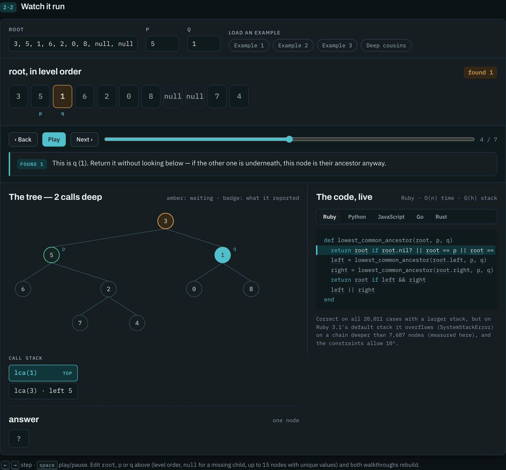
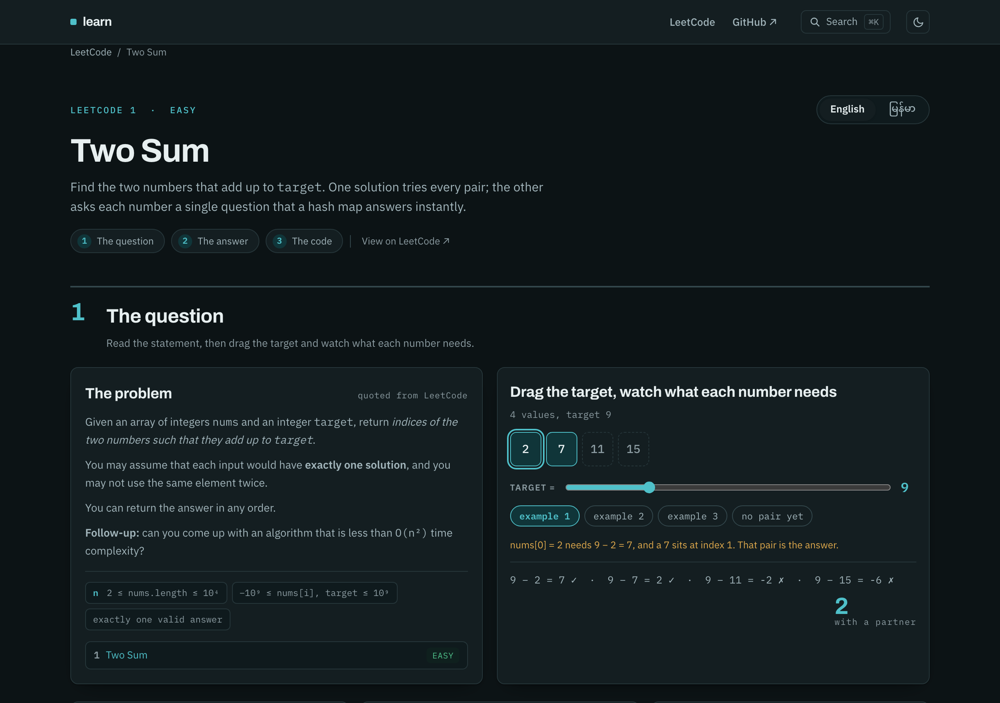
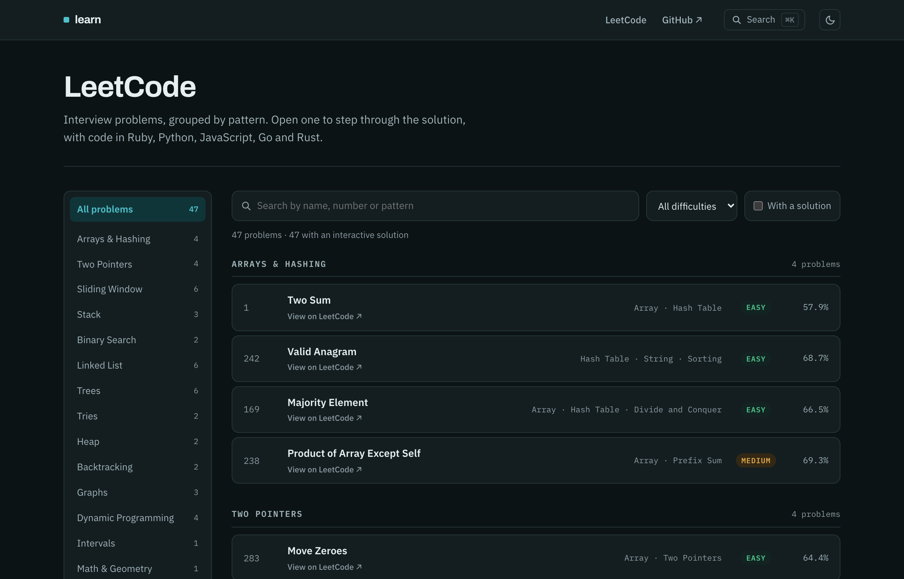
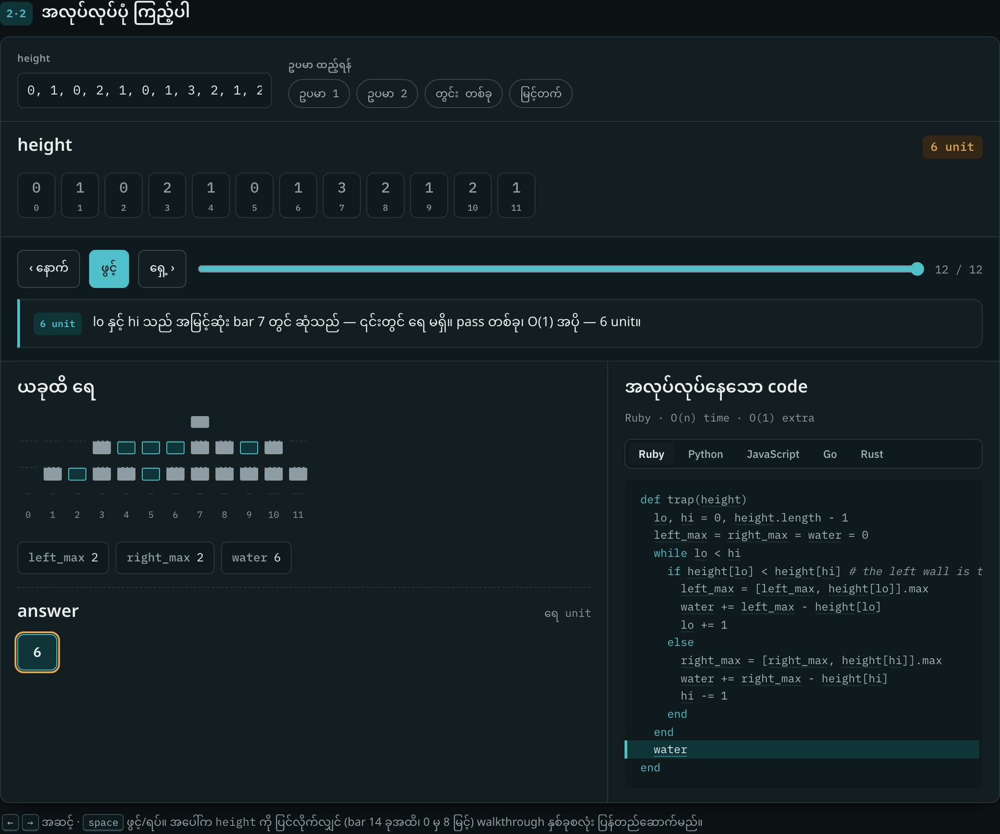

# LeetCode solution pages

**Live: [learn.devmtnaing.com](https://learn.devmtnaing.com).** Open any problem and step through its solution.

[](https://learn.devmtnaing.com/leetcode/lowest-common-ancestor-of-a-binary-tree)

Interactive solutions to interview problems. Each page quotes the problem,
steps through the algorithm one state change at a time, and ends with complete
solutions in Ruby, Python, JavaScript, Go and Rust. Every one of those
solutions was run against thousands of cases before it was published.

Every page follows the same three parts:

1. **The question.** LeetCode's statement, quoted word for word, the worked
   examples, a small widget for the idea the statement hinges on, and the
   traps in its wording.
2. **The answer, step by step.** Pick an approach, step forward and back, and
   watch the state the code actually holds: the hash map, the stack, the call
   stack, the two pointers. The line running is highlighted in your language,
   and every variable shows its value when you hover it.
3. **The whole solution.** Paste-ready code for every approach and language,
   each with a badge saying exactly how it was checked.

The pages are bilingual, English and မြန်မာ (Burmese), in a light and a dark
theme. The screenshots below are all in the dark one.

## Screenshots

**The question.** The statement next to a widget for the one idea it turns on.

[](https://learn.devmtnaing.com/leetcode/two-sum)

**The problem list.** 47 problems grouped by pattern, with search, a difficulty filter and ⌘K from any page.

[](https://learn.devmtnaing.com)

**In Burmese.** Trapping Rain Water with two pointers, finished.

[](https://learn.devmtnaing.com/leetcode/trapping-rain-water?approach=pointers)

## Run it

```sh
npm install
npm run dev        # http://localhost:4321
npm run build      # static site in dist/
npm run check      # structural check of every lesson
npm run audit      # every built page in a real browser (after npm run build)
npm run refresh-problems   # re-read titles, tags and acceptance rates from LeetCode
```

The home page lists 45 interview problems, 15 each of easy, medium and hard,
chosen where three of LeetCode's own study plans agree
([how](docs/problem-list.md)), plus 2 from outside that list, grouped by
pattern (Arrays & Hashing, Two Pointers, Trees, …). Every one of them has a
solution page. To add a problem or fix a page, see
[CONTRIBUTING.md](CONTRIBUTING.md).

## What is in the repo

```
src/pages/index.astro           the problem list
src/pages/leetcode/[slug].astro renders every lesson folder
src/lessons/<slug>/             one folder per solution page
src/lib/                        the shared kit: stepper, stage shapes, trees, i18n
src/styles/                     tokens, site chrome, the lesson page, the stage
scripts/check-lessons.mjs       structure and format check
scripts/audit.mjs               drives every built page in Chromium
scripts/refresh-problems.mjs    refreshes src/data/problems.json from LeetCode
scripts/verify/                 runs every listing in five languages
verify/<slug>/                  each lesson's test corpus and drivers
docs/                           how the problem list was chosen; translation notes; screenshots
wrangler.jsonc                  Cloudflare: serve dist/ at learn.devmtnaing.com
```

The site is fully static: every page is prerendered and served as a file, so
there's no backend. A solution page is a folder of data and one step generator
per approach. The kit supplies the transport, code panel, language switching
and layout. Every lesson has a spec in `verify/`, so `npm run verify --
<slug>` reruns exactly what its badges claim.

## Deploying

Cloudflare Workers serves `dist/` (`wrangler.jsonc`) at
https://learn.devmtnaing.com, and builds it from this repo on every push to
`main`: build command `npm run build`, deploy command `npx wrangler deploy`,
no environment variables. `public/_redirects` sets redirects, and
`public/_headers` sets the cache policy: hashed assets forever, HTML always
revalidated. `npm run serve` runs the same thing locally after a build, and
`npm run deploy` deploys by hand.

## License

[MIT](LICENSE).
