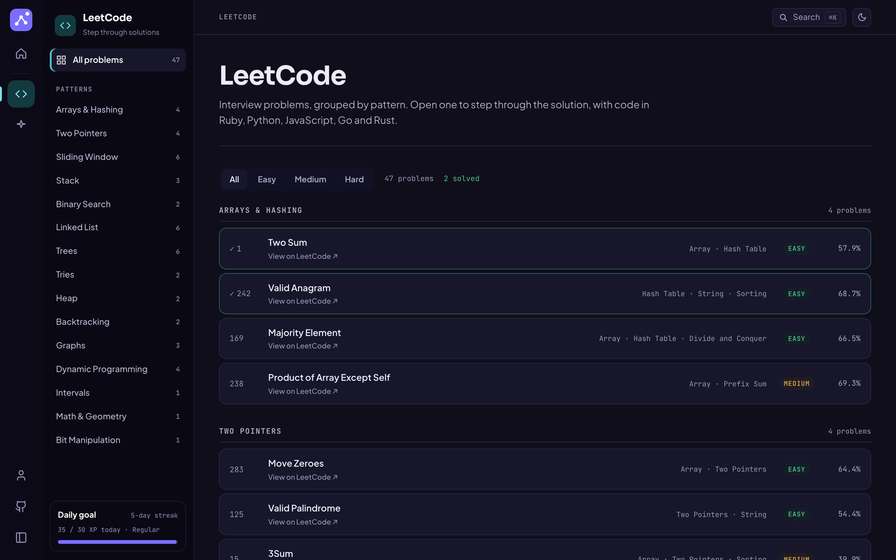
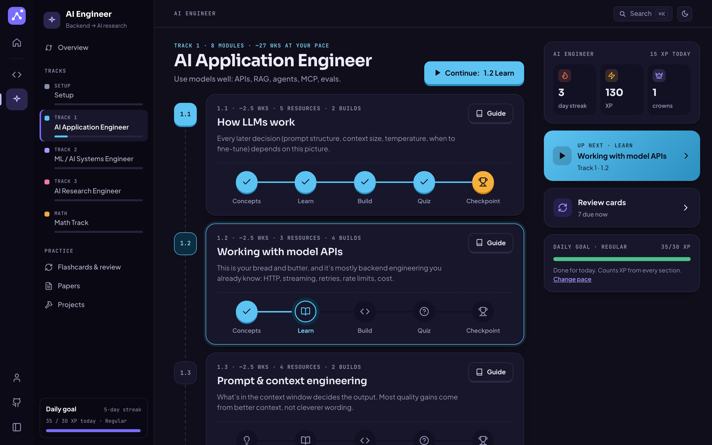
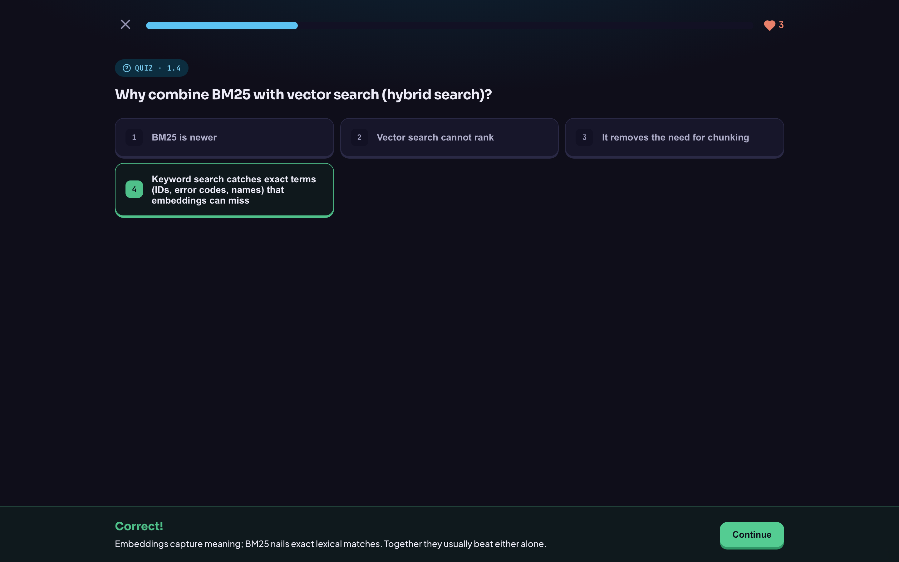

# learn

**Live: [learn.devmtnaing.com](https://learn.devmtnaing.com).** A learning site with two sections that share one design and one progress record:

- **[LeetCode](https://learn.devmtnaing.com/leetcode)**: interview problems you can step through one state change at a time, with tested code in five languages.
- **[AI Engineer](https://learn.devmtnaing.com/ai-engineer)**: a self-study path from backend engineer to AI research engineer, in three tracks, with quizzes, flashcards and portfolio projects.

[](https://learn.devmtnaing.com)

A section rail on the left switches between the sections; each section has its own menu. Progress, XP and streaks are kept per section and add up on the hub. ⌘K searches the section you are in. Light and dark themes; the LeetCode pages are also in မြန်မာ (Burmese). All screenshots here are in the dark theme.

## LeetCode

Each page quotes the problem, steps through the algorithm one state change at a
time, and ends with complete solutions in Ruby, Python, JavaScript, Go and
Rust. Every one of those solutions was run against thousands of cases before it
was published. Every page has the same three parts:

1. **The question.** LeetCode's statement, quoted word for word, the worked
   examples, a small widget for the idea the statement hinges on, and the
   traps in its wording.
2. **The answer, step by step.** Pick an approach, step forward and back, and
   watch the state the code actually holds: the hash map, the stack, the call
   stack, the two pointers. The line running is highlighted in your language,
   and every variable shows its value when you hover it.
3. **The whole solution.** Paste-ready code for every approach and language,
   each with a badge saying exactly how it was checked.

[](https://learn.devmtnaing.com/leetcode/lowest-common-ancestor-of-a-binary-tree?step=4)

The list has 45 interview problems, 15 each of easy, medium and hard, chosen
where three of LeetCode's own study plans agree ([how](docs/problem-list.md)),
plus 2 from outside that list, grouped by pattern. Every one has a solution
page. "Mark as solved" on a page ticks it on the list and earns LeetCode XP.

[](https://learn.devmtnaing.com/leetcode)

**The question.** The statement next to a widget for the one idea it turns on.

[](https://learn.devmtnaing.com/leetcode/two-sum)

**In Burmese.** Trapping Rain Water with two pointers, finished.

[](https://learn.devmtnaing.com/leetcode/trapping-rain-water?approach=pointers)

## AI Engineer

A curriculum for a backend engineer moving into AI, in the order the jobs come:

| Track | Goal | At the course's own pace (~13.5 h a week) |
|---|---|---|
| **1 · AI Application Engineer** | Use models well: APIs, RAG, agents, MCP, evals, agent frameworks, durable workflows | ~3.5–4 months |
| **2 · ML / AI Systems Engineer** | Neural nets from scratch, transformers, fine-tuning, GPUs, inference, distributed training, Kubernetes | ~7–9 months |
| **3 · AI Research Engineer** | Learning theory, scaling, RL and post-training, interpretability, reproducing papers | ~8–12 months, then ongoing |
| **Math** | Three levels, each paired with a track | alongside |

Every module has five steps: **concepts**, the **resources** to work through,
hands-on **builds**, a **quiz** (with hearts and retries), and a **checkpoint**
that earns a crown. You choose a study pace in hours a week, and every time
estimate scales to it. Flashcards come back on a spaced schedule; the reading
list has 57 papers in order; the projects are portfolio capstones with full
specs.

[](https://learn.devmtnaing.com/ai-engineer/track-1)

[](https://learn.devmtnaing.com/ai-engineer/track-1/1-4/quiz)

The course itself is markdown in [`course/`](course/README.md), readable on its
own. The pages are built from it, so editing a track's README updates the site.

## Run it

```sh
npm install
npm run dev        # http://localhost:4321
npm run build      # static site in dist/
npm run check      # structural check of every LeetCode lesson
npm run audit      # every lesson, the hub and the AI pages in a real browser (after build)
npm run verify -- <slug>   # rerun a lesson's listings in five languages
npm run screenshots        # retake docs/screenshots (after build)
npm run refresh-problems   # re-read titles, tags and acceptance rates from LeetCode
```

To add a LeetCode page or change the course, see [CONTRIBUTING.md](CONTRIBUTING.md).

## What is in the repo

```
src/pages/index.astro             the hub
src/pages/profile.astro           progress, the study plan, export and import
src/pages/leetcode/               the problem list and [slug].astro, which renders every lesson
src/lessons/<slug>/               one folder per LeetCode solution page
src/pages/ai-engineer/            AI Engineer overview, tracks, module guides, lesson steps, practice
course/                           the AI Engineer course as markdown (the pages read it at build)
src/lib/ai/                       course parser, quizzes, flashcards, the progress painter
src/components/ai/                Preact islands: lesson steps, practice, profile, progress rail
src/components/                   the shell: section rail, section menu, search, theme
src/data/sections.ts              the sections and each one's menu
src/lib/progress.ts               progress for the whole site: XP per section, streaks, pace
src/lib/                          the LeetCode kit: stepper, stage shapes, trees, i18n
src/styles/                       tokens (one design, a teal and an indigo accent), shell, lessons, AI
scripts/                          lesson check, browser audit, verify, screenshots, problem refresh
verify/<slug>/                    each lesson's test corpus and drivers
docs/                             how the problem list was chosen, translation notes, screenshots
wrangler.jsonc                    Cloudflare: serve dist/ at learn.devmtnaing.com
```

The site is fully static: every page is prerendered and served as a file, and
the interactive parts of the AI Engineer section are small Preact islands on
those pages. Progress lives in the browser (`localStorage`); export it from the
profile to move it. A LeetCode page is a folder of data and one step generator
per approach, and the kit supplies the rest. Every lesson has a spec in
`verify/`, so `npm run verify -- <slug>` reruns exactly what its badges claim.

## License

[MIT](LICENSE).
